```{r, echo = FALSE}
library(knitr)
library(ggplot2)
library(reticulate)
opts_chunk$set(echo = FALSE, out.width = 500, fig.align = "center")
theme424 <- theme_minimal() + 
  theme(
    panel.grid.minor = element_blank(),
    panel.background = element_rect(fill = "#f7f7f7"),
    panel.border = element_rect(fill = NA, color = "#0c0c0c", size = 0.6),
    axis.text = element_text(size = 14),
    axis.title = element_text(size = 16),
    legend.position = "bottom"
  )
theme_set(theme424)
use_condaenv("/Users/ksankaran/miniconda3/bin/python3")
```

1. We are making predictions all the time, often without realizing it. For
example, imagine we are waiting at a bus stop and want to guess how long it will
be before a bus arrives. We can combine many sources of evidence,
    * How many people are currently at the stop? If there are more people, we think
    a bus might arrive soon.
    * What time of day is it? If it's during rush hour, we would expect more
    frequent service.
    * What is the weather like? If it is poor weather, we might expect delays.
    * etc.
    
    To think about the process formally, we could imagine a vector $\mathbf{x}_i \in \mathbb{R}^{D}$ reflecting $D$ characteristics of our environment. 
If we collected data about how long we actually had to wait, call it $y_i$, for
every day in a year, then we would have a dataset
\begin{align*}
\left(\mathbf{x}_1, y_1\right) \\
\left(\mathbf{x}_2, y_2\right) \\
\vdots \\
\left(\mathbf{x}_{365}, y_{365}\right) \\
\end{align*}
and we could try to summarize the relationship $\mathbf{x}_i \to y_i$. Methods
for making this process automatic, based simply on a training dataset, are
called supervised learning methods.

2. In the above example, the inputs were a mix of counts (number of people at
stop?) and categorical (weather) data types, and our response was a nonnegative
continuous value. In general, we could have arbitrary data types for either
input or response variable. A few types of outputs are so common that they come
with their own names,

      * $y_i$ continuous $\to$ regression
      * $y_i$ categorical $\to$ classification
      
    For example, 
    
    * Trying to determine whether a patient's disease will be cured by a
treatment is a classification problem -- the outcomes are either yes, they will
be cured, or no, they won't. 
    * Trying to estimate the crop yield of a plot of
farmland based on a satellite image is a regression problem -- it could be any
continuous, nonnegative number. 

    There are in fact many other types of responses (ordinal, multiresponse,
survival, functional, image-to-image, ...) each which come with their own names
and set of methods, but for our purposes, it's enough to focus on regression and
classification.

3. There is a nice geometric way of thinking about supervised learning. For
regression, think of the inputs on the $x$-axis and the response on the
$y$-axis. Regression then becomes the problem of estimating a one-dimensional
curve from data.

```{r}
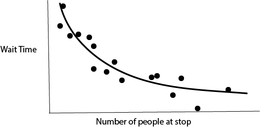
```

   In higher-dimensions, this becomes a surface.

```{r}
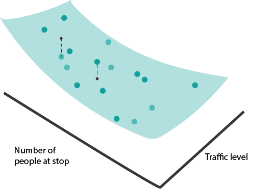
```
  
  If some of the inputs are categorical (e.g., poor vs. good weather), then the
regression function is no longer a continuous curve, but we can still identify
group means.

4. Classification has a similar geometric interpretation, except instead of a
continuous response, we have categorical labels. We can associate classes with
colors. If we have only one input, classification is the problem of learning
which regions of the input are associated with certain colors.

```{r}

```

  In higher-dimensions, the view is analogous. We just want to find boundaries
between regions with clearly distinct colors. For example, for disease
recurrence, blood pressure and resting heart rate might be enough to make a good
guess about whether a patient will have recurrence or not.

```{r}

```

### Model Classes

5. Drawing curves and boundaries sounds simple, but is a surprisingly difficult
problem, especially when the number of potentially informative features $D$ is
large. It helps to have predefined types of curves (and boundaries) that we can
refer to and use to partially automate the process of supervised learning. We'll
call an example of these predefined curve types a "model class." Let's just build some intuition about what each model class looks
like and how we might be able to fit it with data.

#### Linear Models

6. Maybe the simplest curve is a linear one,
\begin{align*}
f_{b}\left(x\right) = b_0 + b_1 x_1.
\end{align*}
Here, $b_0$ gives the $y$-intercept and $b_1$ gives the slope. 

```{r}
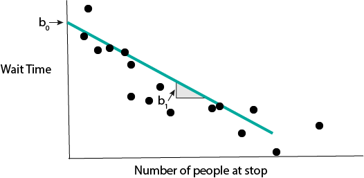
```

When we have many input features, the equivalent formula is
\begin{align*}
f_{b}\left(x\right) = b_0 + b_1 x_1 + \dots + b_{D}x_{D} := b^{T}x,
\end{align*}
where I've used the dot-product from linear algebra to simplify notation (after having appended a 1). This kind of model is called a _linear regression model_.

```{r}
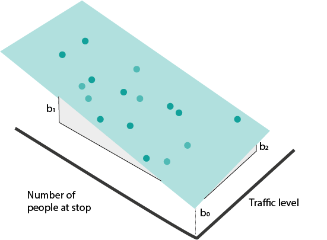
```

7. How do we find a $b$ that fits the data well? We can try to optimize a "loss"
function. This measures the quality of the fitted line. For linear regression, a
good choice is squared error loss,

\begin{align*}
L\left(b\right) = \sum_{i = 1}^{N} \left(y_i - b^{T}x_{i}\right)^2.
\end{align*}

8. For classification, we can imagine drawing a linear boundary. For simplicity,
we'll assume we have only two classes, though a similar partition of the space
can be made for arbitrary numbers of classes.

```{r}
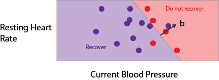
```

To describe this, we need to define a direction $b$ perpendicular to the
boundary. We will say that whenever
\begin{align*}
f_{b}\left(x\right) = \frac{1}{1 + \text{exp}\left(b^T x\right)}
\end{align*}
is larger than 0.5, we're in the red region, and whenever it's smaller than
0.5, we're in the purple region. This kind of model is called a _logistic regression model_.

```{r}
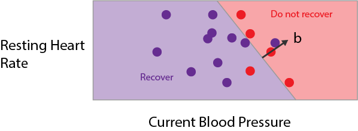
```

9. We need a loss function for logistic regression too. In theory, we could
continue to use squared error loss, but we can do better by considering the fact
that the true response is only one of two values. To make things concrete, say
that $y_i = 1$ whenever it is an red point, otherwise $y_i = 0$. We can use
binary cross-entropy loss,

\begin{align*}
-\left[\sum_{i = 1}^{N} y_i \log\left(f_{b}\left(x_i\right)\right) + \left(1 - y_i\right) \log\left(1 - f_{b}\left(x_i\right)\right)\right]
\end{align*}

To understand this loss, note that each term decomposes into either the blue or
red curve, depending on whether the $y_i$ is 1 or 0.

```{r}
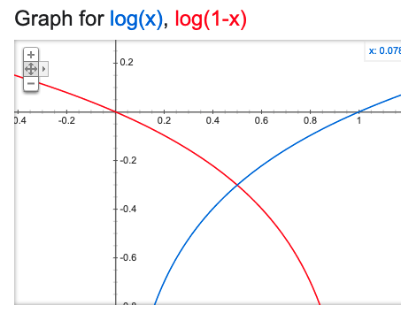
```

If 1 is predicted with probability 1, then there is no loss (and conversely for
0). The loss increases the further the predicted probability is from the true
class.

9. Let's fit a linear regression in code. Below, I'm loading a dataset about
diabetes disease progression. The response $y$ is disease severity one year
after diagnosis, it ranges from 25 (low severity) to 246 (high severity). There
are $D = 10$ numeric predictors; below I print 4 samples corresponding to the first 5 features.

```{python, echo = TRUE}
import numpy as np
import pandas as pd
import matplotlib.pyplot as plt
from sklearn import datasets, linear_model

X, y = datasets.load_diabetes(return_X_y=True)
X[:4, :5] # first five predictors
y[:4] # example response
```

Let's now fit a linear model from $\mathbf{x}_1, \dots, \mathbf{x}_{N}$ to $y$.
The first line tells python that we are using a `LinearRegression` model class.
The second searches over coefficients $b$ to minimize the squared-error loss
between the $b^T x_i$ and $y_i$. The third line prints out the fitted coefficient
$\hat{b}$.

```{python, echo = TRUE}
model = linear_model.LinearRegression()
model.fit(X, y)
model.coef_ # fitted b coefficients
```

10. Let's do the same thing for a logistic regression. This time, we'll use the
Palmer's Penguins dataset, which tries to classify penguins into one of three
types based on their appearance. For example, two of the features are bill
height and bill depth (figure from Allison Horst's `palmerspenguins`
[package](https://allisonhorst.github.io/palmerpenguins/)).

```{r}
include_graphics("figures/penguin-features.png")
```

We'll read the data from a public link and print the first few rows.

```{python, echo = TRUE}
import pandas as pd

penguins = pd.read_csv("https://raw.githubusercontent.com/krisrs1128/stat679_code/0330ce6257ff077c5d4ed9f102af6be089f5c486/examples/week6/week6-4/penguins.csv")
penguins.head()
```
We'll predict `species` using just `bill` length and depth. First, let's make a
plot to see how easy / difficult it will be to create a decision boundary.

```{r, echo = TRUE}
ggplot(py$penguins) +
  geom_point(aes(bill_length_mm, bill_depth_mm, col = species)) +
  scale_color_manual(values = c("#3DD9BC", "#6DA671", "#F285D5")) +
  labs(x = "Bill Length", y = "Bill Depth")
```

11. It seems like we should be able to draw nice boundaries between these
classes. Let's fit the model.

```{python, echo = TRUE}
model = linear_model.LogisticRegression()
penguins = penguins.dropna()
X, y = penguins[["bill_length_mm", "bill_depth_mm"]], penguins["species"]
model.fit(X, y)
penguins["y_hat"] = model.predict(X)
```
The plot below compares the predicted class (left, middle, and right panels)
with the true class (color). We get most of the samples correct, but have a few
missclassifications near the boundaries.

```{r, echo = TRUE}
ggplot(py$penguins) +
  geom_point(aes(bill_length_mm, bill_depth_mm, col = species)) +
  scale_color_manual(values = c("#3DD9BC", "#6DA671", "#F285D5")) +
  labs(x = "Bill Length", y = "Bill Depth") +
  facet_wrap(~ y_hat)
```
Exercise: Repeat this classification, but using at least two additional
predictors.

#### Sparse Linear Models

12. In many cases, we will have recorded many types of features -- coordinates
of $x_{i}$ -- that are not actually related to the response. A model that knows
to ignore irrelevant features will do better than a model that tries to use
all of them. This is the main idea behind using sparsity in linear regression.
We again fit the model
\begin{align*}
f_{b}\left(x\right) = b_0 + b_1 x_1 + \dots + b_{D}x_{D} := b^{T}x,
\end{align*}
but we make the assumption that many of the $b_{d}$ are exactly 0. Graphically,
we imagine that the response does not change at all as we change some of the
inputs, all else held equal.

```{r}
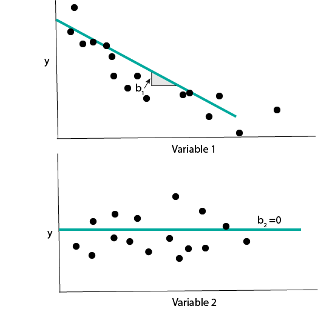
```

13. The same idea can be applied to logistic regression. In this case, having a
coefficient $b_d = 0$  means that the probabilities for different class labels
do not change at all as features $x_d$ is changed.

```{r}
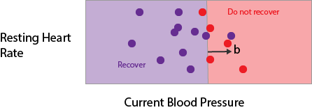
```

14. To implement sparse linear regression using `sklearn`, we can use the
`ElasticNet` class. We'll work with a dataset of American Baseball sports
statistics. The task is to predict each player's salary based on their batting
statistics.

```{python, echo = TRUE}
import pandas as pd


baseball = pd.read_csv("https://github.com/krisrs1128/naamii_summer_2023/raw/main/assets/baseball.csv")
baseball.head()
X, y = baseball.iloc[:, 2:], baseball["salary"]
y = (y - y.mean()) / y.std() # standardize
```
The block below fits the Elastic Net model and saves the coefficients $\hat{b}$.
Notice that most of them are 0 -- only a few of the features make a big difference
in the salary.

```{python, echo = TRUE}
from sklearn import datasets, linear_model
model = linear_model.ElasticNet(alpha=1e-1, l1_ratio=0.5) # in real life, have to tune these parameters
model.fit(X, y)
y_hat = model.predict(X)

beta_hat = model.coef_ # notice the sparsity
beta_hat
```

We can confirm that the predictions are correlated relatively well with the
truth.

```{r}
cbind(py$y, py$y_hat)
```


```{r, echo = TRUE}
baseball <- data.frame(py$X, y = py$y, y_hat = py$y_hat)
ggplot(baseball) +
  geom_point(aes(y, y_hat)) +
  geom_abline(slope = 1, col = "red") +
  labs(x = "True Salary", y = "Predicted Salary")
```

#### Tree-based Models

15. Tree-based models fit a different class of curves. To motivate them,
consider making a prediction for the bus time arrival problem using the
following diagram,

```{r}
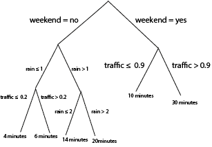
```

Notice that we can use the same logic to do either regression or classification.
For regression, we associate each "leaf" at the bottom of the tree with a
continuous prediction. For classification, we associate leaves with
probabilities for different classes. It turns out that we can train these models
using squared error and cross-entropy losses as before, though the details are
beyond the scope of these notes.

16. It's not immediately obvious, but these rules are equivalent to drawing
curves that are piecewise constant over subsets of the input space. Let's
convince ourselves using some pictures. First, notice that a tree with a single
split is exactly a "curve" that takes on two values, depending on the split
point,

```{r}
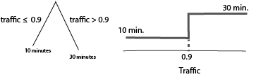
```

If we split the same variable deeper, it creates more steps,

What if we had two variables? Depending on the order, of the splits, we create
different axis-aligned partitions,

```{r}
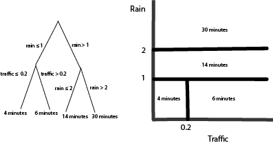
```

Q: What would be the diagram if I had switched the order of the splits (traffic before rain)?

17. A very common variation on tree-based models computes a large ensemble of
trees and then combines their curves in some way. How exactly they are combined
is beyond the scope of these notes, but this is what random forests and gradient
boosted decision trees are doing in the background.

18. We can implement these models in `sklearn` using `RandomForestRegressor` /
`RandomForestClassifier`, and `GradientBoostingRegressor` /
`GradientBoostingClassifier`. Let's just see an example of a boosting classifier
using the penguins dataset. The fitting / prediction code is very similar to what we used for the sparse regression.

```{python, echo = TRUE}
from sklearn.ensemble import GradientBoostingClassifier
model = GradientBoostingClassifier()
X, y = penguins[["bill_length_mm", "bill_depth_mm"]], penguins["species"]
model.fit(X, y)
penguins["y_hat"] = model.predict(X)
```

We use the same visualization code to check predictions against the truth. The
boosting classifier makes no mistakes on the training data.

```{r, echo= TRUE}
ggplot(py$penguins) +
  geom_point(aes(bill_length_mm, bill_depth_mm, col = species)) +
  scale_color_manual(values = c("#3DD9BC", "#6DA671", "#F285D5")) +
  labs(x = "Bill Length", y = "Bill Depth") +
  facet_wrap(~ y_hat)
```


### Relationships across classes

19. The diagram below summarizes the relationships across elements of the model
class.

```{r}
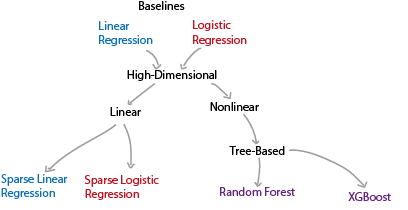
```

20. When should we use which of these approaches? Here are some relative
strengths and weaknesses.

|  | Strengths | Weaknesses |
|---|---|---|
| Linear / Logistic Regression | * Often easy to interpret<br>* No tuning parameters<br>* Very fast to train | * Unstable when many features to pick from<br>* Can only fit linear curves / boundaries (though, see featurization notes) |
| Sparse Linear / Logistic Regression | * Often easy to interpret<br>* Stable even when many features to pick from<br>* Very fast to train | * Can only fit linear curves / boundaries |
| Tree-based Classification / Regression | * Can fit nonlinear functions of inputs | * Can be slow to train<br>* Somewhat harder to interpret |

21. Try matching models to responses in the examples below,

  * Q1: We want to predict whether a patient has a disease given just their genetic
  profile. There are 1000 genes that can serve as predictors. There are only two
  possible responses.
  * Q2: A user on a site has been watching (too many...) episodes of Doctor
  Who. How many more minutes will they remain on the site today? As predictors,
  you have features of their current and past viewing behavior (e.g.,
  current time of day, number of hours on the site per week for each of the last 4 weeks,
  etc.). We suspect that there are important nonlinear relationships between
  these predictors and the response.
  * Q3: We are trying to predict the next hour's total energy production in a wind
  farm. We have a years worth of past production and weather data, but right now,
  we just want a baseline using current wind speed and the last hour's production.

The answers are,

  * A1: Sparse logistic regression. We have two classes, and most of the genes are unlikely to be relevant for classification.
  * A2: A tree-based method, like random forests or gradient boosting. This is because we anticipate a nonlinear relationship.
  * A3: Linear regression. The response is continuous and we just need a baseline
  using two predictors.